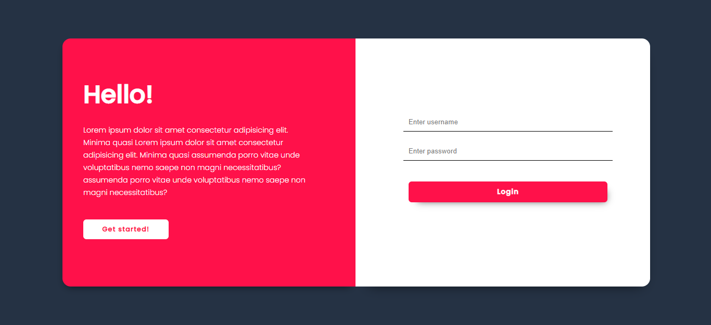
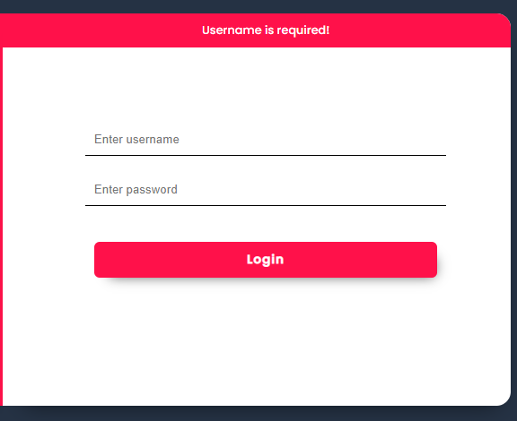
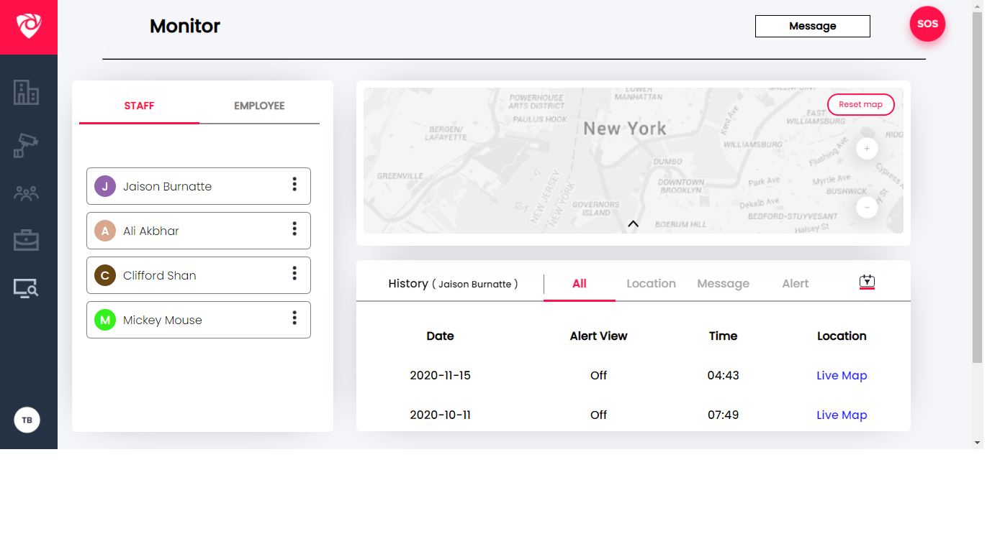
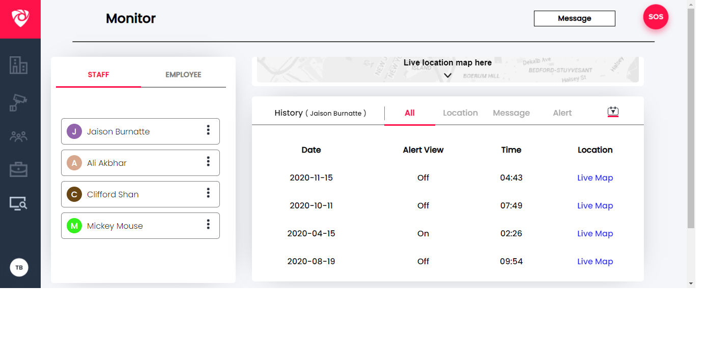

# API Routes
The api consists of 3 main routes

```
POST : api/user/login 
      -> requires a username & password provided in the body
      -> return : JSON web token (expires in 1hr)

GET : api/users 
      -> requires a bearer token return from the login
      -> returns a list of user objects 
         example; [{"id": 1,"name": "Jaison Burnatte"}]
         
GET : api/users/{id}/logs
      -> requires a bearer token return from the login
      -> returns an list of logs for a user with the ID 
         example; 
        {
        "user_id": 1,
        "user": "Jaison Burnatte",
        "logs": [
            {
                "id": 1,
                "date": "2020-02-26",
                "alert_view": false,
                "time": "07:34",
                "latitude": 53.4963900568602,
                "longitude": -0.0812715020512485
            }
        ]}
```


# Components

There are mainly two components, `Login & Dashboard`.
<br/>

The login component handles the authentication part of the web app.
It connects to the `/api/login` endpoint. It uses the token returned from the API and sets it as a _cookie_ named `dogfood`.
<br/>

The Dashboard component consists of multiple function components for each grid item. Such as; Nav, History logs, Users panel. The dashboard component makes use of the cookie set previously when logging in. It validates the cookie, and connects to the `/api/users` and `/api/users/{id}/logs` to get the users and logs of each user dynamically. 


# UI Implementations

## Login


<br/>



## Dashboard


# Issues/Limitations

1. The design pdf was limited only to the UI, and I had to assume some features based on how it looked. And the design might not be an exact replica, since I was not provived with the exact pixels and detail about each item/component. For example, the message box. No information regarding that was provided.

2. In the dashboard, the staff logs table is static (provided a user ID it returns that user's logs), However, all the users had the same ID which made querying difficult.

3. The responiveness of the dashboard is quite buggy. Doesn't support all screens.
    For large screens:
     The map image overflows its container. 
     The user panel's vertical hamburger stretches out of its relative posistion. 
     And the grid's aren't centered anymore.
    For small screens:
     The UI appears very clustered.
     The theme has room for improvement.